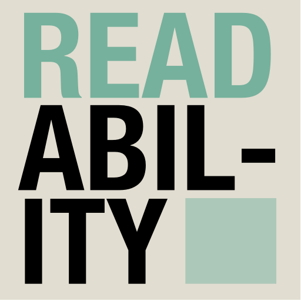

# Readability plugin for Craft CMS 3.x

The Readability plugin will help you to indentify issues with your website content, especially with readability.

It allows you to measure the readability of text using common scoring systems, including:

- Flesch Kincaid Reading Ease
- Flesch Kincaid Grade Level
- Gunning Fog Score
- Coleman Liau Index
- SMOG Index
- Automated Reability Index
- Dale-Chall Readability Score
- Spache Readability Score

You can learn more about these [here](https://readable.io)

## Requirements

This plugin requires Craft CMS 3.0.0-beta.23 or later.

## Installation

To install the plugin, follow these instructions.

1. Open your terminal and go to your Craft project:

        cd /path/to/project

2. Then tell Composer to load the plugin:

        composer require mikestecker/craft3-readability

3. In the Control Panel, go to Settings → Plugins and click the “Install” button for Readability.

## Readability Overview

This plugin was born out of me wanting a simple read time on text. When I discovered the [Text Statistics](https://github.com/DaveChild/Text-Statistics) library, I decided to wrap most everything in here.

## Configuring Readability

There is nothing to configure.

## Using Readability

### Measuring Readability

`Flesch-Kincaid Reading Ease:  {{ someContent | readingEase }}`

### Measuring How Long It Should Take To Read

Measuring how long it takes to read is based off the Flesch-Kincaid Reading Ease. According to [this Wikipedia article](https://en.wikipedia.org/wiki/Reading_%28process%29#Reading_rate), rates of reading include reading for memorization (fewer than 100 words per minute [wpm]); reading for learning (100–200 wpm); reading for comprehension (200–400 wpm); and skimming (400–700 wpm). Reading for comprehension is the essence of the daily reading of most people. Skimming is for superficially processing large quantities of text at a low level of comprehension (below 50%).

If it's scored as easy to read, then the words per minute goes up in the calculation.

`How long will it take to read?  {{ someContent | humanReadingTime }}`

If this is too complicated for you or you just want a simple average reading time, I made a new function to do simple math based off an [average of 250 words per minute](http://www.healthguidance.org/entry/13263/1/What-Is-the-Average-Reading-Speed-and-the-Best-Rate-of-Reading.html).

`How long will it take to read?  {{ someContent | humanAverageReadingTime }}`

### More Text Shenanigans!

#### Count Syllables

`{{ someContent | syllableCount }}`

#### Character, Letter, Sentence, Word Counts

`{{ someContent | characterCount }}`
`{{ someContent | letterCount }}`
`{{ someContent | wordCount }}`
`{{ someContent | sentenceCount }}`

## Readability Roadmap

Some things to do, and ideas for potential features:

* Release it

Brought to you by [Mike Stecker](https://github.com/mikestecker)
